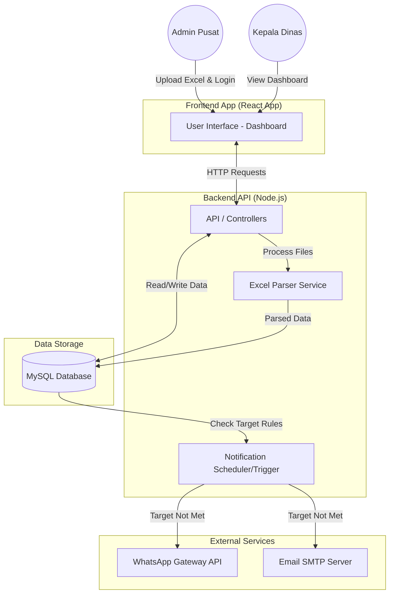
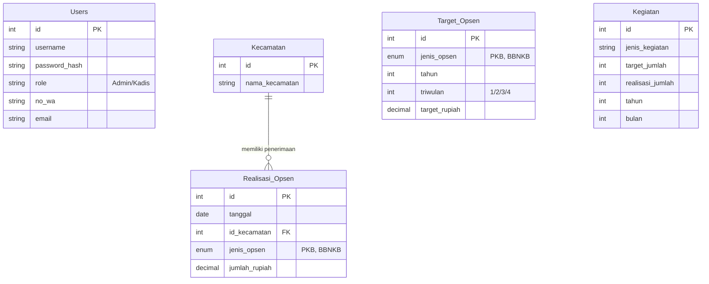

# PRD — Project Requirements Document

## 1. Overview
Pemerintah Kabupaten Magetan membutuhkan sebuah sistem yang dapat memantau penerimaan Pajak Opsen (khususnya Opsen PKB dan BBNKB) secara aktual dan terpusat. Saat ini, proses pemantauan, evaluasi kinerja, dan pencapaian target membutuhkan rekapitulasi data yang terstruktur. 

**SIMPONI Magetan** (Sistem Monitoring Opsen Terintegrasi Kabupaten Magetan) adalah aplikasi berbasis *dashboard* web yang dirancang khusus untuk menyelesaikan masalah tersebut. Aplikasi ini bertujuan memberikan visibilitas penuh kepada Kepala Dinas mengenai target penerimaan, realisasi per kecamatan, kinerja kegiatan, dan evaluasi pendapatan antar waktu. Desain aplikasi akan difokuskan pada kemudahan penggunaan (ramah bagi pengguna senior/kaum *Boomers*) dengan navigasi yang sangat jelas, huruf yang mudah dibaca, dan dibalut dalam nuansa warna biru yang profesional.

## 2. Requirements
- **Akses & Peran:** Sistem melayani 2 peran utama: **Admin Pusat** (bertugas mengunggah data progres melalui file Excel) dan **Kepala Dinas** (bertugas melihat *dashboard* dan evaluasi).
- **Desain Antarmuka (UI/UX):** Menggunakan desain *boomer-friendly*; tombol berukuran besar, *font* yang jelas dan kontras tinggi, navigasi yang intuitif tanpa menu tersembunyi, dan dominasi tema warna biru.
- **Manajemen Data Utama:** Sistem murni bergantung pada unggahan data Excel (*upload*) oleh Admin, tidak ada integrasi dengan sistem dinas lain secara langsung.
- **Ekspor Data:** Sistem harus memungkinkan Kepala Dinas mengunduh laporan ke format Excel.
- **Notifikasi Otomatis:** Sistem harus mampu mendeteksi jika target triwulanan tidak tercapai dan mengirimkan peringatan melalui dasbor aplikasi, Email, dan pesan WhatsApp (WA).

## 3. Core Features
1. **Otentikasi Pengguna:** Sistem *login* sederhana menggunakan *Username* dan *Password*.
2. **Import Data Excel:** Halaman kustom bagi Admin Pusat untuk mengunggah (*upload*) file Excel berisi data realisasi Opsen dan progres kegiatan terbaru.
3. **Menu Dashboard:**
   - Menampilkan visualisasi **Target Opsen (PKB & BBNKB)** dalam format Tahunan, Semester, dan Triwulan.
   - Menampilkan angka Realisasi, Persentase Pencapaian, dan Sisa Target.
   - Menampilkan **Tabel Realisasi Opsen per Kecamatan** di wilayah Kabupaten Magetan.
4. **Menu Kinerja Kegiatan:**
   - Menampilkan tabel/kartu informasi berisi: Jenis Kegiatan, Jumlah Rencana Kegiatan, dan Jumlah Kegiatan yang sudah terlaksana.
5. **Menu Evaluasi:**
   - Fitur analitik komparatif untuk membandingkan perolehan Opsen (PKB & BBNKB) tahun ini dengan tahun sebelumnya (*Year-over-Year*).
   - Filter rentang waktu yang mendetail hingga perbandingan per bulan dan per hari.
   - Tombol "Unduh ke Excel" untuk laporan mandiri.
6. **Sistem Peringatan Dini (Warning System):**
   - Notifikasi/Pemberitahuan otomatis muncul di dalam aplikasi.
   - Mengirim ringkasan peringatan via **Email** dan **WhatsApp** kepada Kepala Dinas apabila target Triwulanan gagal tercapai saat periode berakhir.

## 4. User Flow
**Alur Admin Pusat (Pembaruan Data):**
1. Admin Pusat membuka web SIMPONI Magetan dan *Login*.
2. Admin masuk ke menu "Upload Data".
3. Admin memilih kelengkapan *file* Excel (contoh: Realisasi Penerimaan, Realisasi Kegiatan).
4. Klik "Unggah", sistem memproses data ke dalam *database*. Admin *Logout*.

**Alur Kepala Dinas (Pemantauan):**
1. Kepala Dinas menerima notifikasi WhatsApp/Email jika ada target yang meleset, disertai tautan (opsional).
2. Kepala Dinas membuka web dan *Login*.
3. Sistem mengarahkan langsung ke **Dashboard Utama** (melihat ringkasan capaian dan tabel kecamatan).
4. Kepala Dinas membuka menu **Kinerja Kegiatan** untuk melihat rincian aktivitas tim.
5. Kepala Dinas membuka menu **Evaluasi** untuk membandingkan penerimaan hari ini dengan tahun lalu, lalu menekan tombol "Export Excel" untuk disimpan.

## 5. Architecture
Aplikasi menggunakan arsitektur *Client-Server* standar. *Frontend* menangani antarmuka pengguna, sedangkan *Backend* menangani logika bisnis, pemrosesan file Excel, hingga *trigger* pengiriman pesan ke WA/Email. Keduanya di-*deploy* di platform *cloud*.

## 6. Database Schema
Berikut adalah struktur inti dari tabel *database* yang dibutuhkan untuk mengakomodasi pencatatan Opsen dan Kegiatan.

**Daftar Tabel & Kolom Utama:**
- `Users`: Mengelola akun otentikasi. (Kolom: `id`, `username`, `password_hash`, `role`, `no_wa`, `email`).
- `Kecamatan`: Daftar kecamatan di Magetan. (Kolom: `id`, `nama_kecamatan`).
- `Target_Opsen`: Menyimpan target berdasarkan waktu dan jenis. (Kolom: `id`, `jenis_opsen` (PKB/BBNKB), `tahun`, `triwulan`, `target_rupiah`).
- `Realisasi_Opsen`: Data penerimaan yang diunggah. (Kolom: `id`, `tanggal`, `id_kecamatan`, `jenis_opsen`, `jumlah_rupiah`).
- `Kegiatan`: Memantau kinerja operasional. (Kolom: `id`, `jenis_kegiatan`, `target_jumlah`, `realisasi_jumlah`, `tahun`, `bulan`).

## 7. Tech Stack
Berdasarkan kebutuhan fungsional dan preferensi sistem, berikut adalah teknologi yang akan digunakan:

- **Frontend:** **React.js**. Akan dikombinasikan dengan **Tailwind CSS** untuk mempercepat proses desain tema biru yang responsif dan penyediaan tata letak yang ramah *Boomers* (ukuran teks dapat disesuaikan dengan mudah).
- **Backend:** **Node.js** dengan *framework* **Express.js**. Digunakan untuk membangun REST API.
  - *Library Tambahan Backend:* `multer` dan `xlsx` (untuk import Excel), `exceljs` (untuk export laporan akhir).
  - *Layanan Eksternal:* `Nodemailer` (untuk pengiriman Email) dan API Pihak ketiga penyedia layanan WhatsApp (misal: Fonnte, Wablas, atau Baileys jika mandiri).
- **Database:** **MySQL** untuk memastikan integritas data berelasi dan kemampuan penyaringan data historis yang cepat.
- **Deployment:** 
  - Frontend React di-*deploy* menggunakan **Vercel** untuk kecepatan dan kemudahan akses.
  - *Catatan:* Karena Vercel berorientasi *serverless* dan ini menggunakan Node.js (Express) secara utuh, disarankan *Backend* Node.js + MySQL di-*deploy* di layanan berbasis VPS atau App Platform (seperti Hostinger, Railway, atau VPS lokal Pemkab) agar *cron-job* notifikasi WhatsApp dapat berjalan optimal tanpa batasan *timeout* Vercel. Frontend (React) tetap di Vercel sesuai *request*.